  <h1>Mario Marín Hinojosa</h1>
  <h3>Cybersecurity & AI Engineering Student | Systems Programmer</h3>
  
  

    
    
    
  

---

### About Me

Dual-profile engineer combining rigorous academic training in **Cybersecurity & Artificial Intelligence** (UMA) with high-performance systems programming skills from **42 Málaga**.

My focus is on the intersection of **Deep Learning**, **Vulnerability Research**, and **Secure Architecture**. I don't just use tools—I build them from scratch (C/Unix) and enhance them with AI.

<table>
  <tr>
    <td width="200px"><strong>Currently working on</strong></td>
    <td>Advanced Deep Learning models for financial prediction & SAST tools</td>
  </tr>
  <tr>
    <td><strong>Experience</strong></td>
    <td>Tech Mentor at Google.org Cyber Bootcamp (Trained 100+ students)</td>
  </tr>
  <tr>
    <td><strong>Education</strong></td>
    <td>University of Málaga & 42 Málaga</td>
  </tr>
  <tr>
    <td><strong>Soft Skills</strong></td>
    <td>Technical Leadership, Mentorship, Communication</td>
  </tr>
</table>

---

### Featured Projects

| Project | Description | Tech Stack |
| :--- | :--- | :--- |
| [**Financial Predictive Transformer**](https://github.com/mmarhin/Financial-Predictive-Transformer) | Hybrid Deep Learning model (Transformer + Static Context) to apply Value Investing. Built ETL pipeline for 10 years of financial data. | `PyTorch` `Pandas` `ETL` `Deep Learning` |
| [**Minishell**](https://github.com/mmarhin/Minishell) | Custom Linux shell re-engineered from scratch in C. Handles process creation, signal handling, pipes, redirections, tokenization and manual memory management. | `C` `Unix` `Bash` `Systems Programming` |
| [**MNDefender**](https://github.com/Alman368/MNDefender) | SAST Vulnerability Analysis System integrating NIST NVD API for real-time CVE detection. | `Python` `Flask` `Docker` `SQL` `NIST API` |
| **Gymeatai (in progress)** | AI Health APP leveraging AI for personalized fitness and nutrition plans based on user health data. | `AI` `Mobile Dev` `UI/UX` |

---

### Technical Skills

<table>
<tr>
<td><strong>Languages</strong></td>
<td>

</td>
</tr>
<tr>
<td><strong>AI & Data Science</strong></td>
<td>

</td>
</tr>
<tr>
<td><strong>Security & DevOps</strong></td>
<td>

</td>
</tr>
</table>

---

### GitHub Analytics

  
   
  

---

  <em>"Effective security is as much about people as it is about algorithms."</em>
    
  <strong>Málaga, Spain</strong> · Open to Summer 2026 Internships

